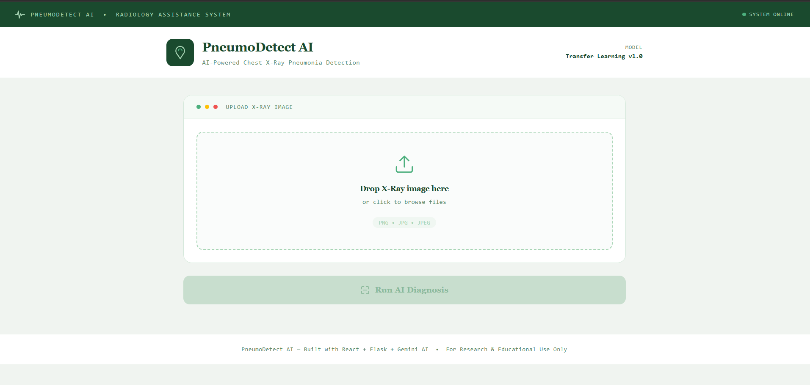
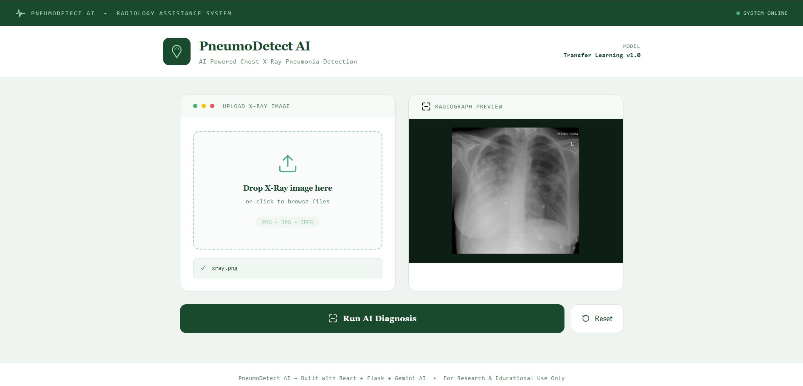
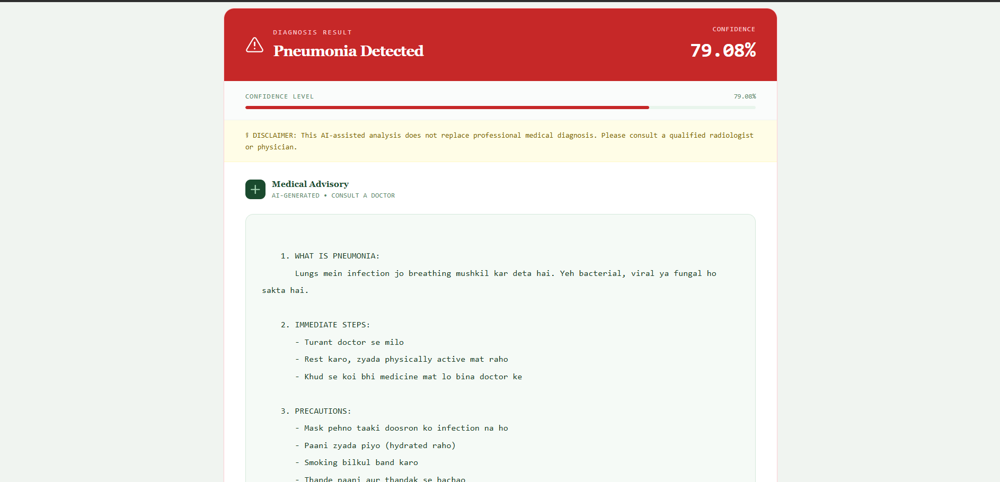
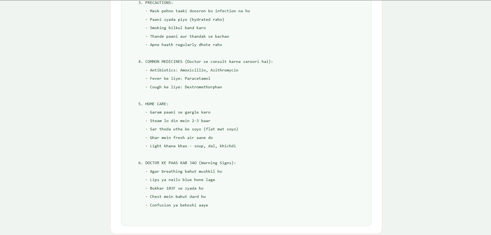

# Deep Learning-Based Pneumonia Detection System

## Overview

This project is a full-stack AI-powered web application that detects pneumonia from chest X-ray images using a Deep Learning model built with TensorFlow/Keras. Users can upload an X-ray image through a modern web interface and receive a prediction along with a confidence score.

The system integrates a React frontend, Node.js backend, Flask ML API, and a trained CNN model to provide an end-to-end pneumonia detection solution.

This project was developed as an MCA Major Project by a team of three members.

---

## Features

* Upload chest X-ray images through a user-friendly interface
* Deep Learning-based pneumonia detection
* Real-time prediction with confidence score
* Full-stack architecture
* REST API integration
* TensorFlow/Keras model deployment
* Responsive frontend built with React

---

## Tech Stack

### Frontend

* React.js
* Vite
* CSS

### Backend

* Node.js
* Express.js

### Machine Learning API

* Flask
* TensorFlow
* Keras
* NumPy
* Pillow

### Version Control

* Git
* GitHub

---

## Project Architecture

X-ray Image → React Frontend → Node.js Backend → Flask ML API → TensorFlow Model → Prediction Result

---

## Project Structure

The application is divided into three major components:

### Frontend

Built using React and Vite, the frontend provides an intuitive interface for users to upload chest X-ray images and view prediction results.

### Backend

Developed using Node.js and Express.js, the backend acts as a bridge between the frontend and the machine learning API.

### ML API

Implemented using Flask and TensorFlow, the ML API loads the trained deep learning model (`pneumonia_model.h5`), processes uploaded X-ray images, and returns prediction results with confidence scores.


---

## How It Works

1. User uploads a chest X-ray image.
2. The frontend sends the image to the backend.
3. The backend forwards the request to the Flask ML API.
4. The TensorFlow model processes the image.
5. The model predicts whether pneumonia is present.
6. The prediction and confidence score are returned to the user.

---

## Installation

### Clone Repository

```bash
git clone https://github.com/AdarshNayak1311/Pneumonia-Detector.git
```

### Frontend Setup

```bash
cd frontend
npm install
npm run dev
```

### Backend Setup

```bash
cd backend
npm install
npm start
```

### ML API Setup

```bash
cd ml-api

pip install flask
pip install flask-cors
pip install tensorflow
pip install tf-keras
pip install pillow
pip install numpy

python app.py
```

---

## Sample Output

Prediction: Pneumonia Detected

Confidence Score: 79.08%

---

## Application Screenshots

### Home Page



### X-ray Upload



### Prediction Result





---

## Future Enhancements

* Multi-disease chest X-ray classification
* User authentication
* Cloud deployment
* Docker containerization
* Grad-CAM heatmap visualization
* Model performance dashboard

---

## Team Information

Developed as part of the MCA Major Project
Team size: 3 members

## Author

Adarsh Nayak

Master of Computer Applications (MCA)

Passionate about Artificial Intelligence, Machine Learning, Deep Learning, and Full-Stack Development.
